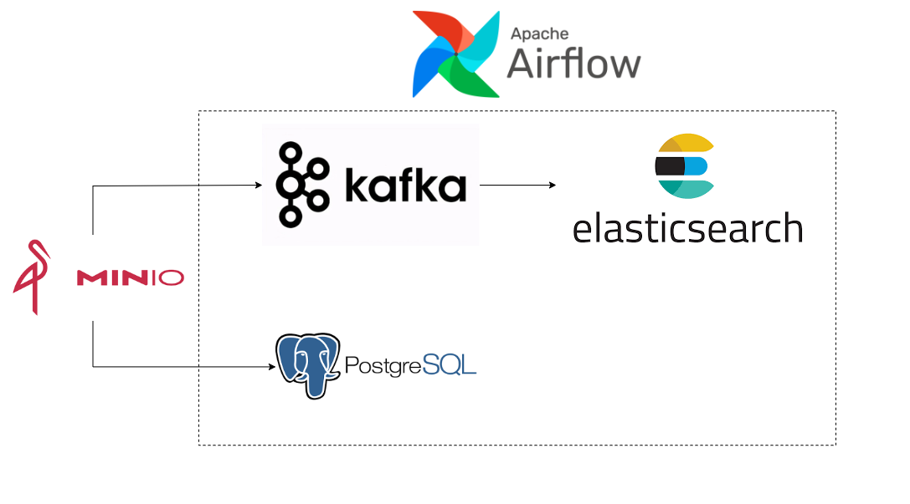
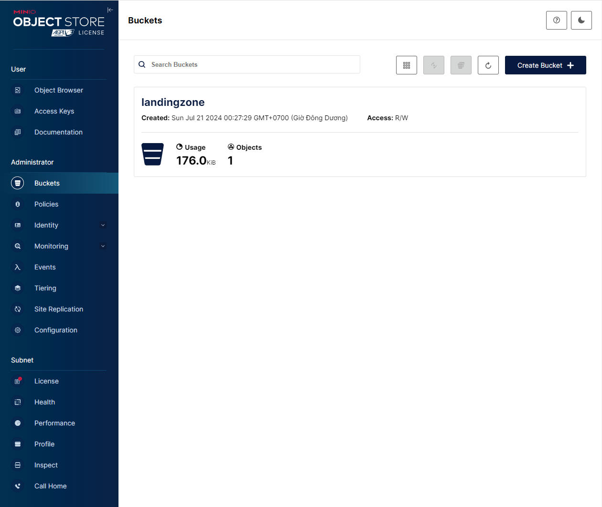
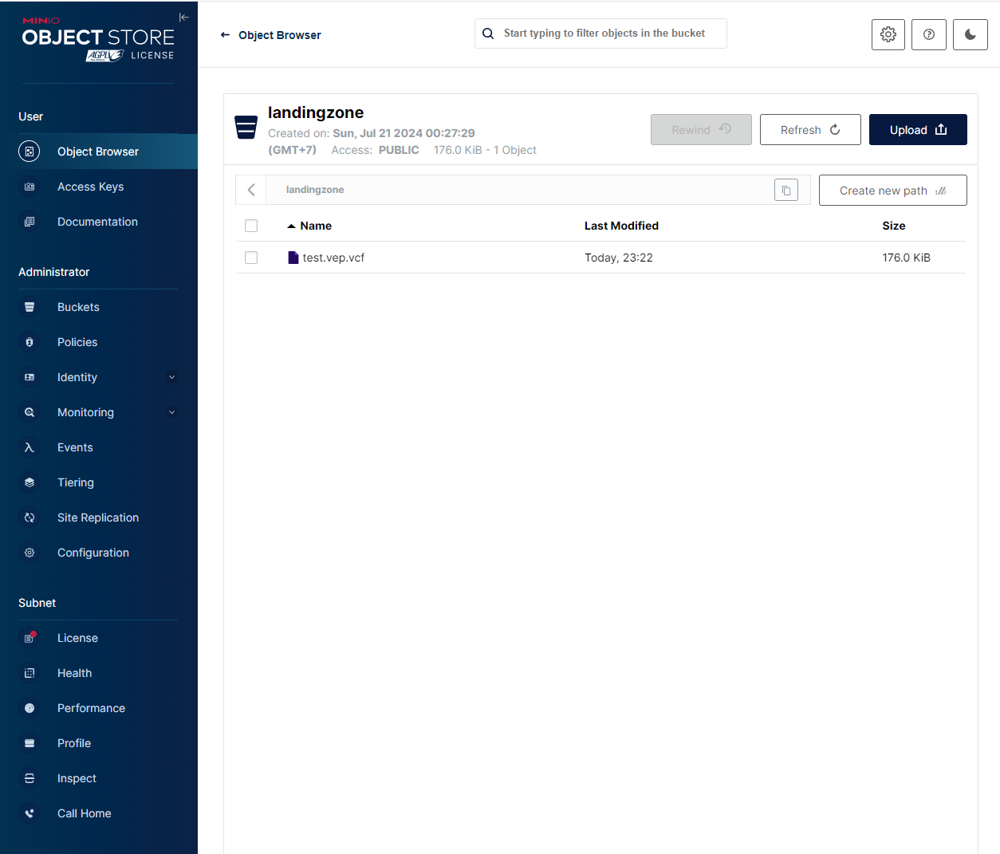
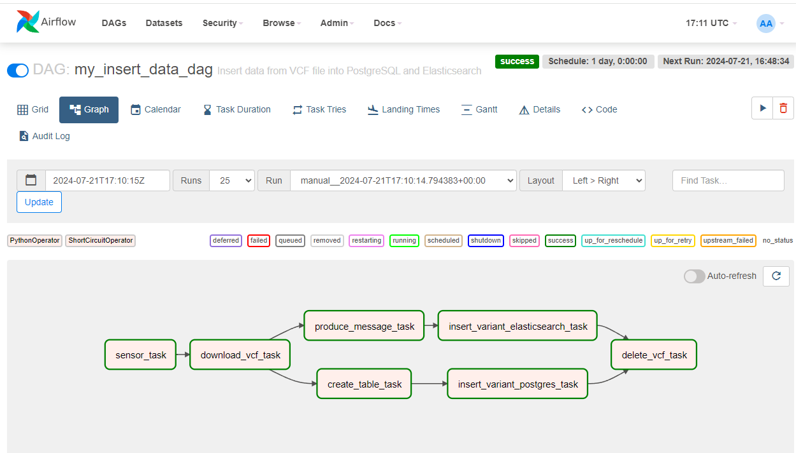
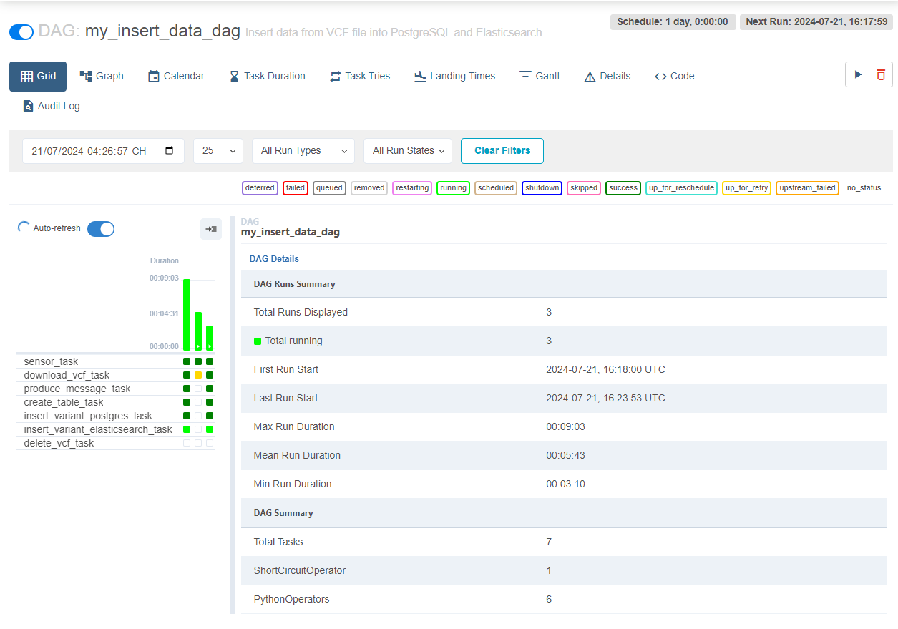
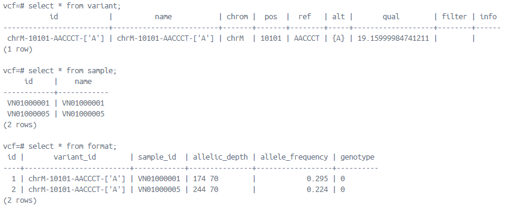
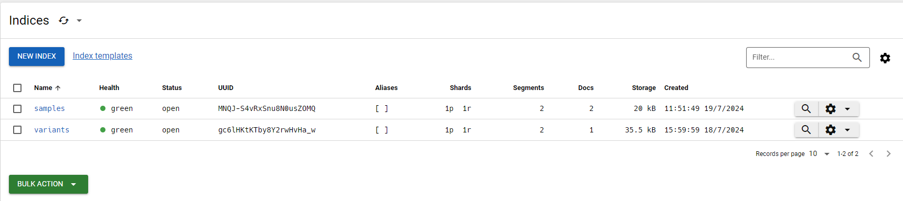
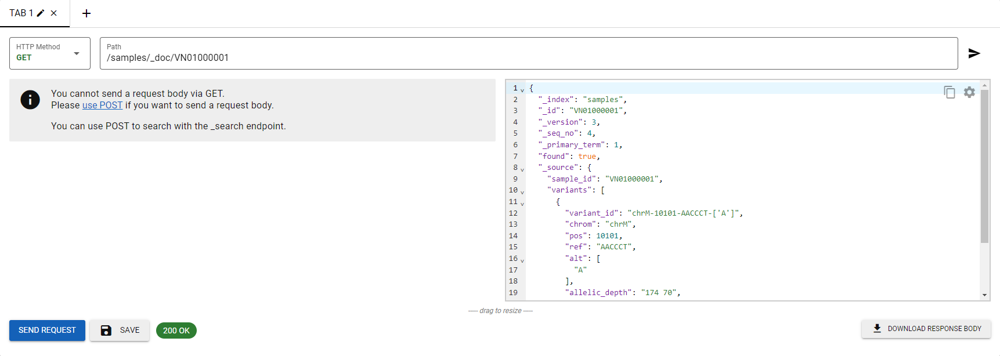
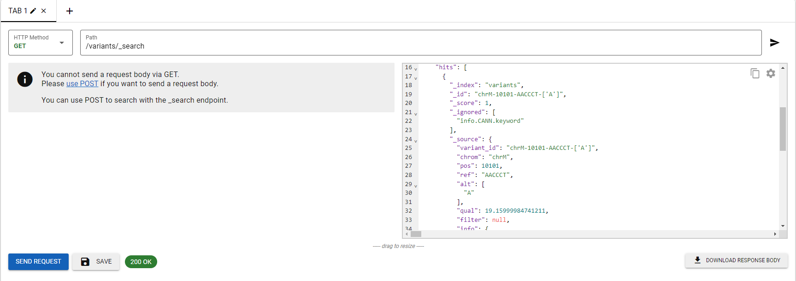

# VCF ETL
## Tổng quan hệ thống:
File chính được để trong dags, các cộng cụ được tạo thông qua Docker-compose và sử dụng chung một hệ thống mạng. Người dùng có thể upload file lên MinIO trong bucket landingzone, sau đó airflow sẽ thực hiện các task, lấy các
file vcf theo cấu trúc stack rồi thực hiện các task bao gồm: tạo bảng trong postgres, insert dữ liệu vào postgres, gửi message vào kafka, 
và insert dữ liệu vào elasticsearch rồi cuối cùng xóa file ở landingzone.











## Các task thành phần:
1. `sensor_task`: Kiểm tra file có tồn tại trong MinIO không
2. `download_file_task`: Download file từ MinIO về 
3. `create_table_task`: Tạo bảng trong postgres 
4. `produce_message_task`: Đọc file vcf và gửi message vào kafka
5. `insert_variant_postgres_task`: Insert dữ liệu local vào postgres
6. `insert_variant_elasticsearch_task`: Insert dữ liệu từ kafka broker vào elasticsearch
7. `delete_file_task`: Xóa file ở landingzone trong MinIO

## Dữ liệu:
### Postgres:

### Elasticsearch:

- Search theo sample:



```angular2html
GET /samples/_doc/VN01000001
{
  "_index": "samples",
  "_id": "VN01000001",
  "_version": 3,
  "_seq_no": 4,
  "_primary_term": 1,
  "found": true,
  "_source": {
    "sample_id": "VN01000001",
    "variants": [
      {
        "variant_id": "chrM-10101-AACCCT-['A']",
        "chrom": "chrM",
        "pos": 10101,
        "ref": "AACCCT",
        "alt": [
          "A"
        ],
        "allelic_depth": "174 70",
        "allele_frequency": "0.295",
        "genotype": 0
      }
    ]
  }
}
```

- Search theo variant:



```angular2html
GET /variants/_search
{
  "took": 2,
  "timed_out": false,
  "_shards": {
    "total": 1,
    "successful": 1,
    "skipped": 0,
    "failed": 0
  },
  "hits": {
    "total": {
      "value": 1,
      "relation": "eq"
    },
    "max_score": 1,
    "hits": [
      {
        "_index": "variants",
        "_id": "chrM-10101-AACCCT-['A']",
        "_score": 1,
        "_ignored": [
          "info.CANN.keyword"
        ],
        "_source": {
          "variant_id": "chrM-10101-AACCCT-['A']",
          "chrom": "chrM",
          "pos": 10101,
          "ref": "AACCCT",
          "alt": [
            "A"
          ],
          "qual": 19.15999984741211,
          "filter": null,
          "info": {
            "AC": 1,
            "AF": 0.04500000178813934,
            "AN": 22,
            "FS": 30.992000579833984,
            "MQ": 22.56999969482422,
            "MQRankSum": 1.100000023841858,
            "QD": 0.3700000047683716,
            "ReadPosRankSum": 0.8799999952316284,
            "SOR": 2.9040000438690186,
            "CANN": "-|regulatory_region_variant|MODIFIER|||RegulatoryFeature|ENSR00000344264|CTCF_binding_site||||||||||rs1462685959|1||||deletion|||||||||||||chr1:g.10111_10115del|||||||||||||A549:POISED&A673:INACTIVE&B:POISED&B_(PB):NA&CD14+_monocyte_(PB):NA&CD14+_monocyte_1:INACTIVE&CD4+_CD25+_ab_Treg_(PB):NA&CD4+_ab_T:NA&CD4+_ab_T_(PB)_1:NA&CD4+_ab_T_(PB)_2:NA&CD4+_ab_T_(Th):NA&CD4+_ab_T_(VB):NA&CD8+_ab_T_(CB):NA&CD8+_ab_T_(PB):NA&CMP_CD4+_1:NA&CMP_CD4+_2:NA&CMP_CD4+_3:NA&CM_CD4+_ab_T_(VB):NA&DND-41:INACTIVE&EB_(CB):NA&EM_CD4+_ab_T_(PB):NA&EM_CD8+_ab_T_(VB):NA&EPC_(VB):NA&GM12878:POISED&H1-hESC_2:NA&H1-hESC_3:POISED&H9_1:NA&HCT116:INACTIVE&HSMM:POISED&HUES48:NA&HUES6:NA&HUES64:NA&HUVEC:ACTIVE&HUVEC-prol_(CB):NA&HeLa-S3:ACTIVE&HepG2:INACTIVE&K562:INACTIVE&M0_(CB):NA&M0_(VB):NA&M1_(CB):NA&M1_(VB):NA&M2_(CB):NA&M2_(VB):NA&MCF-7:INACTIVE&MM.1S:INACTIVE&MSC:NA&MSC_(VB):NA&NHLF:POISED&NK_(PB):NA&NPC_1:NA&NPC_2:NA&NPC_3:NA&PC-3:INACTIVE&PC-9:POISED&SK-N.:POISED&T_(PB):NA&Th17:NA&UCSF-4:NA&adrenal_gland:NA&aorta:NA&astrocyte:POISED&bipolar_neuron:POISED&brain_1:NA&cardiac_muscle:POISED&dermal_fibroblast:INACTIVE&endodermal:NA&eosinophil_(VB):NA&esophagus:NA&foreskin_fibroblast_2:NA&foreskin_keratinocyte_1:NA&foreskin_keratinocyte_2:NA&foreskin_melanocyte_1:NA&foreskin_melanocyte_2:NA&germinal_matrix:NA&heart:NA&hepatocyte:NA&iPS-15b:NA&iPS-20b:NA&iPS_DF_19.11:NA&iPS_DF_6.9:NA&keratinocyte:POISED&kidney:NA&large_intestine:NA&left_ventricle:NA&leg_muscle:NA&lung_1:NA&lung_2:NA&mammary_epithelial_1:ACTIVE&mammary_epithelial_2:NA&mammary_myoepithelial:NA&monocyte_(CB):NA&monocyte_(VB):NA&mononuclear_(PB):NA&myotube:INACTIVE&naive_B_(VB):NA&neuron:NA&neurosphere_(C):NA&neurosphere_(GE):NA&neutro_myelocyte:NA&neutrophil_(CB):NA&neutrophil_(VB):NA&osteoblast:INACTIVE&ovary:NA&pancreas:NA&placenta:NA&psoas_muscle:NA&right_atrium:NA&right_ventricle:NA&sigmoid_colon:NA&small_intestine_1:NA&small_intestine_2:NA&spleen:NA&stomach_1:NA&stomach_2:NA&thymus_1:NA&thymus_2:NA&trophoblast:NA&trunk_muscle:NA,-|TF_binding_site_variant|MODIFIER|||MotifFeature|ENSM00525532133|||||||||||rs1462685959|1||1||deletion|||||||||||||chr1:g.10111_10115del|||||||||ENSM00525532133|7|N||,-|TF_binding_site_variant|MODIFIER|||MotifFeature|ENSM00205183900|||||||||||rs1462685959|1||1||deletion|||||||||||||chr1:g.10111_10115del|||||||||ENSM00205183900|9|N||,-|TF_binding_site_variant|MODIFIER|||MotifFeature|ENSM00207949539|||||||||||rs1462685959|1||1||deletion|||||||||||||chr1:g.10111_10115del|||||||||ENSM00207949539|15|N||,-|TF_binding_site_variant|MODIFIER|||MotifFeature|ENSM00208132675|||||||||||rs1462685959|1||1||deletion|||||||||||||chr1:g.10111_10115del|||||||||ENSM00208132675|9|N||,-|TF_binding_site_variant|MODIFIER|||MotifFeature|ENSM00523601055|||||||||||rs1462685959|1||1||deletion|||||||||||||chr1:g.10111_10115del|||||||||ENSM00523601055|6|N||,-|TF_binding_site_variant|MODIFIER|||MotifFeature|ENSM00207314130|||||||||||rs1462685959|1||1||deletion|||||||||||||chr1:g.10111_10115del|||||||||ENSM00207314130|14|N||,-|TF_binding_site_variant|MODIFIER|||MotifFeature|ENSM00521930390|||||||||||rs1462685959|1||-1||deletion|||||||||||||chr1:g.10111_10115del|||||||||ENSM00521930390|10|N||,-|TF_binding_site_variant|MODIFIER|||MotifFeature|ENSM00209489825|||||||||||rs1462685959|1||-1||deletion|||||||||||||chr1:g.10111_10115del|||||||||ENSM00209489825|10|N||,-|TF_binding_site_variant|MODIFIER|||MotifFeature|ENSM00524980244|||||||||||rs1462685959|1||1||deletion|||||||||||||chr1:g.10111_10115del|||||||||ENSM00524980244|11|N||"
          },
          "samples": [
            {
              "sample_id": "VN01000001",
              "allelic_depth": "174 70",
              "allele_frequency": "0.295",
              "genotype": 0
            },
            {
              "sample_id": "VN01000005",
              "allelic_depth": "244 70",
              "allele_frequency": "0.224",
              "genotype": 0
            }
          ]
        }
      }
    ]
  }
}

```
## Ý tưởng chính:
- Sử dụng Airflow để schedule các task
- ETL file từ local vào postgres để lưu trữ, một số file không có variant_id sẽ đươc đánh thành `{variant.CHROM}-{variant.POS}-{variant.REF}-{variant.ALT`
- Gửi file vcf vào kafka, và consume kafka broker để insert vào elasticsearch, nhằm mục đích tìm kiếm nhanh hơn
